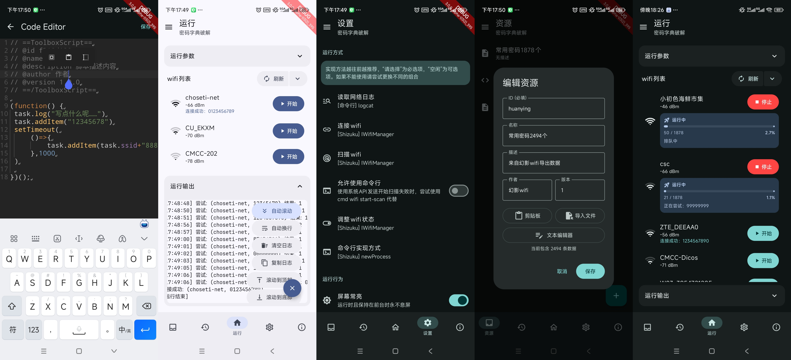
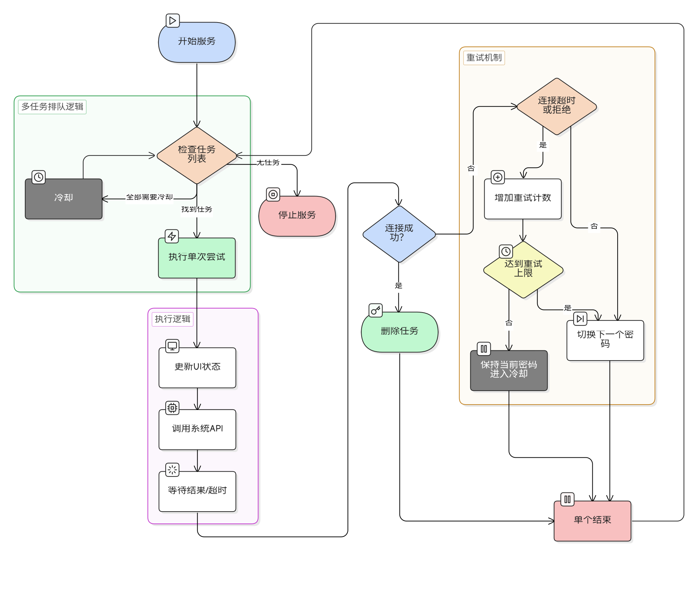

> 最近学业很忙，没时间更新，预计要过几个月（2026/01/30）
> 看起来最新的版本又写成屎山了，太散了可维护性差，下个版本加上跑pin的，继续重构！（2026/03/12）
# wifi工具箱

[](https://github.com/bszapp/android-wifi-pojie/stargazers) [](https://github.com/bszapp/android-wifi-pojie/releases)

最新版本点击下载：

[](https://github.com/bszapp/android-wifi-pojie/releases/latest) [](https://github.com/bszapp/android-wifi-pojie/releases/latest)

应用截图：



~~屎山评级：~~
[](https://sonarcloud.io/summary/new_code?id=bszapp_android-wifi-pojie)
[](https://sonarcloud.io/summary/new_code?id=bszapp_android-wifi-pojie)
[](https://sonarcloud.io/summary/new_code?id=bszapp_android-wifi-pojie)
[](https://sonarcloud.io/summary/new_code?id=bszapp_android-wifi-pojie)

（AI太好用了你们知道吗）

---

v3.x版本，使用kotlin重构项目，包名改为com.wifi.toolbox

部分功能尚未完善，有功能改进建议或者新功能建议欢迎来这里提议：[意见征集](https://github.com/bszapp/android-wifi-pojie/discussions/18)

纯root使用说明：在工作模式设置页将所有功能选中“命令行”以及“aidl”模式，然后在设置中勾选“启用aidl服务”并重启应用

旧版本（b站封号时的最后一个版本，使用mdc设计）不再维护：[前往v2仓库](https://github.com/bszapp/android-wifi-pojie/tree/v1.x-v2.x)

## 功能介绍

### 密码字典破解
#### 使用方式

##### 选择模式

首次使用需要选择运行模式，推荐全部使用Shizuku模式，读取网络日志使用命令行

如果没有条件可以全部使用系统API模式。但是执行过程可能会误报，没有前者稳定，且不支持握手超次模式

~~画大饼：增加引导界面，自动配置模式~~

##### 开始运行

在“运行”页中心是wifi列表，点击对应右侧的“开始”按钮，选择密码本即可运行

当然，你可以同时开启多个任务，程序会自动排队运行，具体流程如程序原理图片所示

##### 密码本管理

在“资源”页面你可以管理密码本，你可以直接点右下角新建-导入-选择txt文件（或者json/js文件）直接使用

也可以选择普通/脚本类型的密码本新建

###### 普通类型
和幻影wifi的格式一样，一行一个密码，程序会轮流尝试

本应用增加了ID、描述、作者、版本等额外参数

其中ID不能和其他重复，格式必须匹配正则/^[a-zA-Z][a-zA-Z0-9._-]+$/

存储在应用内部目录，文件名为ID.json，格式JSON

###### 脚本类型
每次生成密码本会执行一遍脚本，在脚本中可以读取到要连接的ssid，并生成结果

脚本的执行环境是WebView，所以可以使用一些WebView特性（如fetch，但有跨域限制）

以下是一个例子，展示所有可用的功能：
```javascript
// ==ToolboxScript==
// @id {ID}
// @name 脚本名称
// @description 脚本描述内容
// @author 作者
// @version 1.0.0
// ==/ToolboxScript==

console.log("先加一个密码…") //输出使用console.log
task.addItem("12345678") //添加使用task.addItem
console.log("等一秒…")
await wait(1000); //代码默认嵌套在async function内，可以使用await
console.log("再来一个！");
task.addItem(task.ssid + "888") //使用task.ssid获取要运行的wifi的名称

try {
	console.log("请求网络试试…");
	const response = await fetch('https://uapis.cn/api/v1/network/myip'); //可以使用WebView自带的工具，但是有cors限制
	const data = await response.json();
	console.log("本机IP: " + data.ip);
	console.log("归属地: " + data.region);
} catch (err) {
	console.log("请求失败: " + err.message);
}
console.log("完成");
```

存储在应用内部目录，文件名为ID.js，格式为js脚本

#### 程序原理


[](https://star-history.com/#bszapp/android-wifi-pojie&Date)
